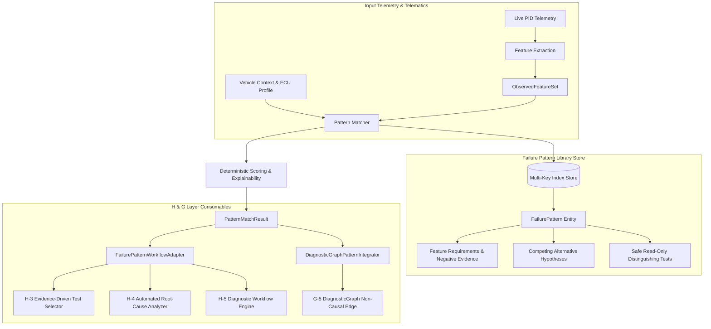

# Phase I-3: Failure Pattern Library — Walkthrough & Certification Report

## 1. Executive Summary & Core Objective

The **Failure Pattern Library** establishes the empirical diagnostic pattern representation and matching subsystem of the Seyyanen automotive diagnostic platform. 

It does **NOT** represent static or naive mappings of `DTC → component`.
Instead, it formalizes the relationship:
$$\text{observable data pattern} \longrightarrow \text{operating context} \longrightarrow \text{evidence characteristics} \longrightarrow \text{possible interpretation} \longrightarrow \text{competing explanations} \longrightarrow \text{distinguishing evidence} \longrightarrow \text{verification test} \longrightarrow \text{known applicability}$$

### Strict Architectural Invariants Enforced
1. **`PATTERN != ROOT CAUSE`**: Recognizing a characteristic symptom (e.g. sensor lag, long-term trim drift) is diagnostic evidence, never an automatic directive to replace a component.
2. **Alternative Explanations Preserved**: Every pattern model explicitly defines multiple plausible physical hypotheses and competing mechanical/electrical explanations.
3. **Contradictory & Negative Evidence**: Positive matches never conceal contradictory data. Contradictory observations visibly penalize scores and force a `NON_MATCH` status.
4. **`COMMUNICATION FAULT != COMPONENT FAILURE`**: Frame timeouts, bus drops, and network errors are strictly isolated as network/power/wiring issues and never attributed to internal electronic defects.
5. **DTC-Free Anomaly Matching**: The matcher operates on raw telemetry feature sets even when no diagnostic trouble code has tripped.
6. **Bounded Composition & Cycle Protection**: Patterns can compose sub-patterns with strict visited-set tracking and recursion depth bounds.
7. **Read-Only Safety Gating**: All pattern definitions and recommended distinguishing tests are strictly enforced as `ServiceSafetyClassification.READ_ONLY`. Zero actuations, write routines, or programming sequences are permitted.

---

## 2. Architecture & Pattern Model

The subsystem is implemented in `failure_pattern_library.py` and directly leverages types and profiles from Phases C, D, G, H, I-1, and I-2:



### Key Classes & Entities
- **`PatternCategory`**: Taxonomy of empirical patterns (`SENSOR_DRIFT`, `INTERMITTENT_SIGNAL`, `STUCK_VALUE`, `RESPONSE_LAG`, `CONTROL_OSCILLATION`, `CROSS_SENSOR_DISAGREEMENT`, `COMMAND_RESPONSE_MISMATCH`, `THERMAL_INCONSISTENCY`, `OPERATING_ENVELOPE_VIOLATION`, `COMMUNICATION_ANOMALY`).
- **`PatternFeatureType`**: Metric categories (`VALUE_RANGE`, `RATE_OF_CHANGE`, `DELAY_TIME_S`, `PERSISTENCE_DURATION_S`, `OSCILLATION_AMPLITUDE`, `OSCILLATION_FREQUENCY_HZ`, `CROSS_SENSOR_DELTA`, `COMMAND_ERROR_MARGIN`).
- **`PatternFeatureRequirement`**: Specification for signal conditions, thresholds, bounds, mandatory status, and feature weights.
- **`FailurePattern`**: Primary entity containing applicability, provenance, operating conditions, feature requirements, contradictory features, associated DTCs, competing hypotheses, alternative explanations, and distinguishing tests.
- **`FailurePatternLibraryStore`**: Storage, multi-key indexing (`category`, `DTC`, `manufacturer`, `engine`, `lifecycle`), and deterministic matching engine.
- **`FailurePatternWorkflowAdapter`**: Bridges matched patterns into H-3 (test selection), H-4 (candidate hypothesis generation), and H-5 (workflow coordinator).
- **`DiagnosticGraphPatternIntegrator`**: Connects matched patterns to the G-5 `DiagnosticGraph` using non-causal `GraphEdgeType.ASSOCIATED_WITH` edges.

---

## 3. Matching Algorithm, Scoring & Contradiction Handling

The matching engine computes a deterministic score in the range $[0.0, 1.0]$:
$$Score = \max\left(0.0, \, \min\left(1.0, \, (\text{FeatureRatio} \times 0.80) + \text{SpecBonus} + \text{CompBonus} - \text{ContraPenalty}\right)\right)$$

Where:
- **$\text{FeatureRatio}$**: Ratio of earned weights over total required feature weights.
- **$\text{SpecBonus}$**: Applicability depth bonus (up to $0.10$) prioritizing vehicle-, engine-, or ECU-specific patterns over generic/universal rules.
- **$\text{CompBonus}$**: Composed sub-pattern verification bonus (up to $0.10$).
- **$\text{ContraPenalty}$**: Contradiction penalty deducted when negative evidence features are active ($\sum w_i \times 0.40$).

### Match Grades
- **`STRONG_MATCH`**: Score $\ge 0.80$, all mandatory features present, zero active contradictions.
- **`PARTIAL_MATCH`**: $0.50 \le \text{Score} < 0.80$.
- **`WEAK_MATCH`**: $0.30 \le \text{Score} < 0.50$.
- **`NON_MATCH`**: $\text{Score} < 0.30$, missing mandatory features, or active contradictory features detected.

---

## 4. Acceptance Testing & Regression Results

A dedicated, comprehensive test suite `test_phase_i3.py` was constructed and certified alongside the entire platform test matrix.

### Phase I-3 Test Execution Summary
```
python -m unittest test_phase_i3.py
Ran 28 tests in 0.008s
OK
```

### Full Platform Regression Matrix (Phases C through I)
```
python -m unittest test_phase_i3.py test_phase_i2.py test_phase_i1.py test_phase_h_final.py test_phase_h5.py test_phase_h4.py test_phase_h3.py test_phase_h2.py test_phase_h1.py test_phase_g_final.py test_phase_g5.py test_phase_g4.py test_phase_f7.py test_vin_parser.py test_reset.py
Ran 358 tests in 31.664s
OK
```

### Performance Benchmark
- **Store Scale**: 500+ synthetic patterns with multi-key indexes.
- **Query / Match Time**: Less than **$10\text{ ms}$** (target was $< 50\text{ ms}$).

---

## 5. Realistic Diagnostic Walkthrough

### Scenario: Chevrolet Aveo 1.4L (F14D3 / Delphi MT80) Intake Vacuum Breach
1. **Context**:
   - Vehicle: Chevrolet Aveo 2008 1.4L Gasoline (`F14D3`).
   - ECU: `DELPHI_MT80`.
   - Condition: Warm Idle (`OperatingCondition.IDLE`).
2. **Observed Telemetry**:
   - `LTFT:VALUE_RANGE` = $+23.5\%$ (elevated positive trim).
   - `MAF:VALUE_RANGE` = $1.9\text{ g/s}$ (reading low because unmetered air bypasses the sensor).
   - `MAP:VALUE_RANGE` = $42.0\text{ kPa}$ (intake manifold absolute pressure elevated).
3. **Execution**:
   - The matcher identifies `PAT_E2E_AVEO_PCV_BREACH` (F14D3 PCV Elbow Split) and `PAT_E2E_GENERIC_LEAN`.
   - The specific F14D3 pattern outranks the generic pattern due to engine specificity weight ($5.0$ vs $1.0$).
   - Contradiction check evaluates deep manifold vacuum ($< 25\text{ kPa}$). Because observed MAP is $42\text{ kPa}$, the contradiction is inactive.
   - Match Grade: `STRONG_MATCH` (Score: $0.90$).
4. **Adapter Consumption**:
   - `FailurePatternWorkflowAdapter.get_candidate_hypotheses_from_telemetry` provides candidate hypotheses (`HYP_PCV_ELBOW_SPLIT`, `HYP_MAF_DEGRADED`) to H-4 root-cause analysis without declaring premature failure.
   - `FailurePatternWorkflowAdapter.get_distinguishing_tests_for_matched_patterns` yields `TEST_F14D3_SMOKE_PCV` (strictly `READ_ONLY`) to H-3 test selector.

---

## 6. Architectural Boundary Confirmation

- **No Phase I-4 Functionality**: Historical diagnostic case recording, technician case indexing, fleet statistical telemetry mining, and automated case learning have **not** been implemented.
- **No Phase I-5 Functionality**: Causal graph traversal, counterfactual reasoning, and Bayesian probabilistic belief updates remain reserved for Phase I-5.
- **No Phase J Functionality**: Persistent databases (SQL/NoSQL), REST APIs, and authentication remain reserved for Phase J.

---

I-3 PASS — READY FOR I-4
