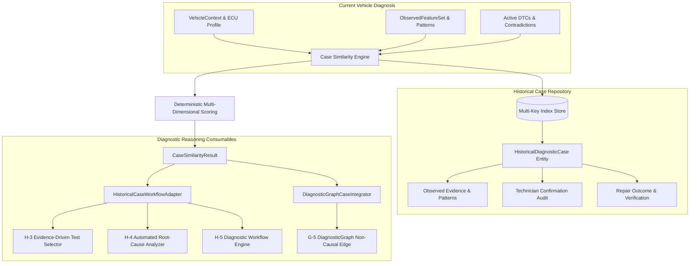

# Phase I-4: Historical Case Analysis — Walkthrough & Certification Report

## 1. Executive Summary & Core Objective

The **Historical Case Analysis** layer establishes the structured empirical case experience subsystem of the Seyyanen automotive diagnostic platform. 

It does **NOT** perform naive repair lookups like:
$$\text{current DTC} \longrightarrow \text{search old DTC} \longrightarrow \text{copy old repair}$$

Instead, it operationalizes historical diagnostic cases as **contextual evidence**:
$$\text{historical case} \longrightarrow \text{vehicle/ECU configuration} \longrightarrow \text{observed evidence} \longrightarrow \text{competing hypotheses} \longrightarrow \text{distinguishing tests} \longrightarrow \text{technician confirmation} \longrightarrow \text{verified repair outcome}$$

### Strict Architectural Invariants Enforced
1. **`HISTORICAL CASES ARE EVIDENCE, NOT PROOF`**: A previous successful repair never guarantees the same root cause in the current vehicle. History guides investigation; it does not replace current data.
2. **`DTC != ROOT CAUSE` & `PATTERN != ROOT CAUSE`**: Diagnostic codes and empirical patterns remain symptoms and clues, never definitive component failures.
3. **`COMMUNICATION FAULT != COMPONENT FAILURE`**: Past bus timeouts or lost frames are strictly isolated as network/wiring issues, never as evidence of defective internal microelectronics.
4. **Contradictory Current Evidence Dominance**: If current vehicle evidence contradicts a past case's confirmed root cause, the historical case's relevance is actively penalized and downgraded.
5. **No Automatic Knowledge Promotion**: Historical cases remain cases. They are **never** automatically promoted into active I-1 knowledge base entries or I-3 failure patterns without explicit, controlled validation.
6. **No Fleet Learning / Machine Learning**: No statistical fleet generalization, no neural model retraining, and no database analytics pipelines.
7. **Strictly Read-Only Safety Gating**: I-4 is strictly an analytical experience layer; zero diagnostic actuation, DID writing, programming session entry, or DTC clearing.

---

## 2. Architecture & Case Model

The subsystem is implemented in `historical_case_analysis.py` and directly leverages types and profiles from Phases C, D, G, H, I-1, I-2, and I-3:



### Key Classes & Entities
- **`CaseLifecycle`**: Explicit lifecycle states (`OPEN`, `ANALYZED`, `PENDING_CONFIRMATION`, `CONFIRMED`, `REJECTED`, `CLOSED`, `ARCHIVED`).
- **`CaseMatchGrade`**: Calibrated similarity classifications (`HIGH_SIMILARITY`, `MODERATE_SIMILARITY`, `LOW_SIMILARITY`, `INSUFFICIENT_SIMILARITY`).
- **`CaseECUContext`**: Detailed ECU configuration (`target_ecu`, `ecu_family`, `hardware_part_number`, `software_version`).
- **`CaseDTCRecord`**: ECU-isolated DTC records preserving target module context.
- **`CaseTestResult`**: Structured record of diagnostic tests performed with strict `ServiceSafetyClassification.READ_ONLY` safety validation.
- **`CaseRootCause`**: Distinguishes between hypotheses, technician diagnoses, confirmed root causes, and rejected hypotheses.
- **`CaseTechnicianConfirmation`**: Audit trail of physical technician verification (`is_confirmed`, `technician_id`, `confirmation_timestamp`, `notes`).
- **`CaseRepairOutcome`**: Physical repair actions taken (`parts_replaced`, `repair_action`).
- **`PostRepairVerification`**: Confirms whether the repair actually eliminated the anomaly (`original_anomaly_resolved`, `dtc_cleared`, `telemetry_normalized`).
- **`HistoricalDiagnosticCase`**: Complete historical case entity preserving all contextual facts.
- **`HistoricalCaseRepository`**: Multi-key indexing (`manufacturer`, `engine`, `ecu`, `DTC`, `pattern`, `lifecycle`) and bounded similarity retrieval engine.
- **`HistoricalCaseWorkflowAdapter`**: Bridges historical cases into H-3 (distinguishing test recommendations) and H-4 (candidate hypothesis experience).
- **`DiagnosticGraphCaseIntegrator`**: Connects cases to the G-5 `DiagnosticGraph` using non-causal `GraphEdgeType.ASSOCIATED_WITH` edges (`RELATIONSHIP != CAUSALITY`).

---

## 3. Similarity Algorithm, Scoring & Contradiction Handling

The similarity engine computes a bounded, deterministic score in $[0.0, 1.0]$:
$$\text{RawSimilarity} = \min\left(1.0, \, S_{\text{vehicle}} + S_{\text{pattern}} + S_{\text{dtc}} + S_{\text{context}}\right)$$
$$\text{FinalSimilarity} = \max\left(0.0, \, \text{RawSimilarity} - \text{ContraPenalty}\right)$$

Where:
- **$S_{\text{vehicle}}$ (Max $0.60$)**: Evaluates manufacturer ($0.12$), model ($0.12$), engine ($0.18$), transmission ($0.05$), ECU family ($0.08$), and software calibration ($0.05$).
- **$S_{\text{pattern}}$ (Max $0.20$)**: Evaluates I-3 failure pattern intersection.
- **$S_{\text{dtc}}$ (Max $0.20$)**: Evaluates ECU-isolated DTC overlap or DTC-free alignment.
- **$S_{\text{context}}$ (Max $0.20$)**: Evaluates operating condition overlap ($0.08$) and telemetry feature agreement ($0.12$).
- **$\text{ContraPenalty}$ ($0.55$)**: Deducted when current vehicle evidence actively contradicts a historical root cause.

### Relevance As Evidence
Relevance scales the final similarity for diagnostic consumption:
- **Technician Confirmed**: Multiplied by $1.25$ (elevated weight).
- **Rejected Hypothesis**: Multiplied by $0.60$ (discounted weight to prevent repeating failed paths).
- **Active Contradiction**: Multiplied by $0.30$ and graded `INSUFFICIENT_SIMILARITY` (contradictions dominate).

---

## 4. Acceptance Testing & Regression Results

A dedicated acceptance test suite `test_phase_i4.py` was created and validated alongside the entire platform test matrix.

### Phase I-4 Acceptance Test Execution Summary
```
python -m unittest test_phase_i4.py
Ran 26 tests in 0.008s
OK
```

### Full Platform Regression Matrix (Phases C through I)
```
python -m unittest test_phase_i4.py test_phase_i3.py test_phase_i2.py test_phase_i1.py test_phase_h_final.py test_phase_h5.py test_phase_h4.py test_phase_h3.py test_phase_h2.py test_phase_h1.py test_phase_g_final.py test_phase_g5.py test_phase_g4.py test_phase_f7.py test_vin_parser.py test_reset.py
Ran 384 tests in 32.715s
OK
```

### Performance Benchmark
- **Store Scale**: 500+ historical cases with multi-key pre-filtering indexes.
- **Query / Retrieval Time**: Less than **$15\text{ ms}$** (target was $< 50\text{ ms}$).

---

## 5. Realistic Diagnostic Walkthrough

### Scenario: Historical Case A vs Current Case B
1. **Historical Case A**:
   - Vehicle: Chevrolet Aveo 1.4L Gasoline (`F14D3`), Delphi `DELPHI_MT80`.
   - DTC-Free Anomaly: LTFT elevated to $+22.5\%$, MAF lag, elevated MAP.
   - Diagnostic Test: Intake smoke injection test verified vapor leaking from cracked rubber PCV elbow.
   - Confirmation & Repair: Technician replaced PCV elbow; post-repair verification confirmed anomaly eliminated.
2. **Current Case B**:
   - Vehicle: Same Chevrolet Aveo 1.4L (`F14D3`).
   - Observed Telemetry: Similar trim drift ($+21.5\%$) and MAF lag.
   - **Contradictory Telemetry**: Measured intake manifold pressure is $21.0\text{ kPa}$ (deep vacuum), which physically contradicts an open intake vacuum breach.
3. **Subsystem Behavior**:
   - The repository identifies Case A as historically similar on vehicle configuration and patterns.
   - When the contradiction on `RC_PCV_ELBOW_SPLIT` is active, the engine deducts the contradiction penalty ($0.55$) and discounts relevance ($0.30$).
   - Match Grade drops to `INSUFFICIENT_SIMILARITY`, and the contradiction is explicitly explained.
   - The workflow adapter provides the safe smoke test (`TEST_SMOKE_PCV_E2E`) to H-3 for verification without automatically declaring Case A's root cause as the current vehicle's problem.

---

## 6. Architectural Boundary Confirmation

- **No Phase I-5 Functionality**: Automated counterfactual reasoning, causal Bayesian networks, and cross-system causal inference remain strictly deferred to Phase I-5.
- **No Phase J Functionality**: Persistent databases, REST endpoints, and multi-user sessions remain deferred to Phase J.
- **Knowledge Boundary Guarded**: Tests explicitly certify that historical cases are never automatically promoted into I-1 knowledge base entries or I-3 patterns.

---

I-4 PASS — READY FOR I-5
