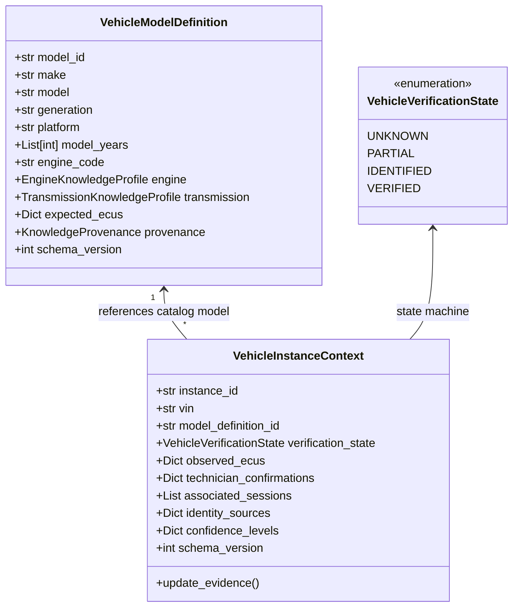
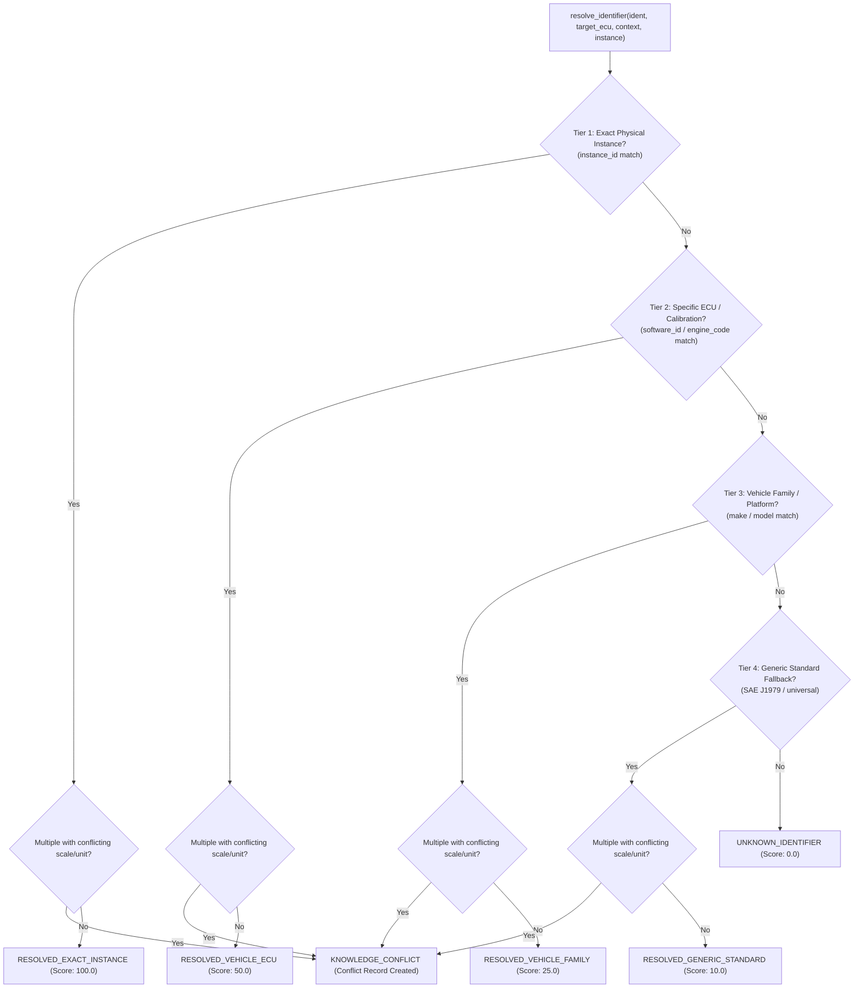

# Phase L-1 Walkthrough: Vehicle and ECU Knowledge Foundation
=============================================================================
**Seyyanen Automotive Diagnostic Platform**  
*Architecture Authority & Verification Document*

---

## 1. Architectural Role of Phase L-1

Phase L-1 establishes the authoritative foundation for vehicle and ECU knowledge in Seyyanen. Prior to L-1, vehicle attributes were largely inferred or flatly represented in session metadata, and diagnostic parameters (PIDs/DIDs) relied on disparate heuristic dictionaries.

L-1 introduces a rigorous, typed, and persistent knowledge domain:
```
                                +-------------------------------------------+
                                |      Vehicle & ECU Knowledge Store        |
                                |       (vehicle_ecu_knowledge.py)          |
                                +-------------------------------------------+
                                                      |
                 +------------------------------------+-----------------------------------+
                 |                                    |                                   |
                 v                                    v                                   v
   +---------------------------+       +-------------------------------+      +----------------------------+
   |  Vehicle Identity Domain  |       |     ECU Knowledge Domain      |      | Diagnostic Identifier Domain|
   | - VehicleModelDefinition  |       | - ECUKnowledgeProfile         |      | - DiagnosticIdentifierKnowledge|
   |   (Catalog, PQ35, EA111)  |       |   (ECM, TCM, MT80, MED9.5)    |      | - 5-Tier Precedence Resolver|
   | - VehicleInstanceContext  |       | - Hardware / Software IDs     |      | - Conflict Detection Engine|
   |   (Physical VIN, Car A/B) |       | - Standard Protocols (CAN/UDS)|      | - Single-Pass Decode/Units |
   | - Verification States     |       | - Multi-ECU Header Separation |      | - No Double-Scaling Safety |
   +---------------------------+       +-------------------------------+      +----------------------------+
                 |                                    |                                   |
                 +------------------------------------+-----------------------------------+
                                                      |
                                                      v
                                +-------------------------------------------+
                                |      J-3 Relational Persistence Layer     |
                                |   (diagnostic_persistence.py / SQLite)    |
                                +-------------------------------------------+
                                                      |
                    +---------------------------------+-------------------------------+
                    v                                 v                                 v
        [D-Layer Telemetry / DTC]         [H-Layer Guided Workflows]      [I-Layer Diagnostic Reasoning]
        (Context-Aware Baselines)         (ECU-Specific Procedures)       (Contextual Root Causes)
```

### Core Invariants Enforced:
1. **Vehicle Identity != ECU Identity != Session != Telemetry**: Vehicle catalog models describe theoretical specs; vehicle instances represent physical machines; ECU profiles describe specific electronic controllers; sessions record diagnostic visits.
2. **Deterministic Resolution**: Identifier resolution always yields the exact same candidate or explicit conflict, completely independent of thread scheduling or evaluation order.
3. **No Double-Scaling**: Physical value decoding (`decode_physical_value`) occurs strictly once, applying byte endianness, sign, scale, and offset in a single pass.
4. **Safety Separation**: Knowledge of privileged services (e.g. 0x14, 0x27, 0x2E, 0x2F) never bypasses the J-5 Security or G-1/J-1 Safety gates.
5. **No Speculation**: Incomplete evidence results in `PARTIAL` or `UNKNOWN` states, never fabricated identities.

---

## 2. Vehicle Identity Model

The vehicle identity model strictly decouples catalog taxonomy from physical vehicles:



### Progressive Evidence Advancement:
- `UNKNOWN`: Initial state with zero evidence.
- `PARTIAL`: Inferred from passive CAN broadcast headers or partial fragments.
- `IDENTIFIED`: Standard 17-character VIN decoded or model match confirmed.
- `VERIFIED`: Confirmed VIN combined with ECU software/calibration match or technician confirmation.

---

## 3. ECU Identity Model

The ECU identity model (`ECUKnowledgeProfile`) represents individual electronic controllers on the vehicle network:

| Attribute | Type | Description | Example |
| :--- | :--- | :--- | :--- |
| `logical_id` | `str` | Canonical role identifier | `"ECM"`, `"TCM"`, `"ABS"`, `"BCM"` |
| `ecu_type` | `ECUTargetType` | Functional classification | `ECUTargetType.ENGINE` |
| `module_family` | `Optional[str]` | Hardware/controller architecture | `"DELPHI_MT80"`, `"BOSCH_MED9.5.10"` |
| `hardware_id` | `Optional[str]` | Physical part / hardware number | `"HW_25181234"` |
| `software_id` | `Optional[str]` | Firmware / calibration ID | `"SW_28019455"` |
| `request_header`| `str` | ISO 15765-4 / UDS 11-bit/29-bit CAN ID | `"7E0"` (ECM), `"7E1"` (TCM) |
| `response_header`| `str`| CAN response ID | `"7E8"` (ECM), `"7E9"` (TCM) |
| `protocol` | `str` | Diagnostic framing standard | `"ISO_15765_4_CAN_11BIT"`, `"UDS"` |
| `supported_services`| `Set[str]` | Read-oriented diagnostic services | `{"01", "09", "22"}` |

### Multi-ECU Isolation:
- `canonical_key` formats namespaced identifiers: `"ECM:1640"` vs `"TCM:1640"`.
- Communication errors on ECM never invalidate TCM telemetry.
- Transport addressing is decoupled from diagnostic reasoning.

---

## 4. Identifier Knowledge Model & Precedence

`DiagnosticIdentifierKnowledge` (and alias `DiagnosticIdentifierDefinition`) provides canonical metadata for every diagnostic parameter (OBD PID, UDS DID, or manufacturer signal):



### 5-Tier Precedence Hierarchy:
1. **Tier 1 — Exact Instance (`RESOLVED_EXACT_INSTANCE`, 100.0)**: Definitions bound directly to physical instance UUID (e.g. customized aftermarket sensors).
2. **Tier 2 — Specific ECU / Calibration (`RESOLVED_VEHICLE_ECU`, 50.0)**: Definitions matching specific software versions, ECU hardware families, or engine codes.
3. **Tier 3 — Vehicle Family (`RESOLVED_VEHICLE_FAMILY`, 25.0)**: Definitions confirmed applicable to vehicle make, model, generation, or platform.
4. **Tier 4 — Generic Standard (`RESOLVED_GENERIC_STANDARD`, 10.0)**: Standard SAE J1979 / universal fallbacks.
5. **Unknown / Unresolved (`UNKNOWN_IDENTIFIER`, 0.0)**: Fail-closed fallback when no applicable definition exists.

---

## 5. Unit, Scaling, and Byte Representation

All physical conversion occurs in `DiagnosticIdentifierKnowledge.decode_physical_value()`:
- **Big-Endian & Little-Endian Support**: Configured via `ByteOrder.BIG_ENDIAN` (`>`) and `ByteOrder.LITTLE_ENDIAN` (`<`).
- **Data Types Supported**:
  - `UINT8` / `INT8` (1 byte)
  - `UINT16` / `INT16` (2 bytes)
  - `UINT24` (3 bytes)
  - `UINT32` / `INT32` (4 bytes)
  - `FLOAT32` (IEEE 754 float)
  - `BITFIELD` / `STRING_ASCII`
- **Formula**:
  $$\text{Physical Value} = (\text{Unscaled Integer} \times \text{scaling}) + \text{offset}$$
- **Double-Scaling Prevention**: Decoding is idempotent and performed in a single pass directly on raw bytes.

---

## 6. Storage Schema & J-3 Relational Persistence

Phase L-1 extends the canonical `DiagnosticRepository` with dedicated collections and schema versioning:

| Collection Name | Record Type | Key Structure |
| :--- | :--- | :--- |
| `vehicle_models` | `VehicleModelDefinition` | `model_id` (e.g. `"VW_GOLF_V_16_FSI"`) |
| `vehicle_instances` | `VehicleInstanceContext` | `instance_id` (UUID) |
| `diagnostic_identifiers` | `DiagnosticIdentifierKnowledge` | Canonical Key (e.g. `"ECM:010C"`) |

### Database Schemas Added to SQLite:
```sql
CREATE TABLE IF NOT EXISTS vehicle_models (
    model_id TEXT PRIMARY KEY,
    make TEXT,
    model TEXT,
    generation TEXT,
    engine_code TEXT,
    data TEXT,
    created_at REAL
);

CREATE TABLE IF NOT EXISTS vehicle_instances (
    instance_id TEXT PRIMARY KEY,
    vin TEXT,
    model_definition_id TEXT,
    verification_state TEXT,
    data TEXT,
    created_at REAL,
    updated_at REAL
);

CREATE TABLE IF NOT EXISTS diagnostic_identifiers (
    canonical_key TEXT PRIMARY KEY,
    identifier TEXT,
    target_ecu TEXT,
    service_id TEXT,
    name TEXT,
    data TEXT,
    created_at REAL
);
```

---

## 7. Cross-Layer Integration (D, H, I, Security)

1. **D-Layer (Telemetry / Sensor Quality)**:
   `ContextualSignalInterpretation` provides nominal envelopes (`min_normal`, `max_normal`, `operating_condition`) based on verified vehicle model and engine displacement.
2. **H-Layer (Workflow & Test Sequencer)**:
   `ContextualWorkflowAdapter` selects guided test procedures and tests suited specifically for the detected engine family and transmission type.
3. **I-Layer (Automated Root Cause Analysis)**:
   DTC interpretations rank root causes according to ECU hardware and software calibration (e.g. Delco MT80 vs Bosch MED9.5).
4. **J-5 Security Gate**:
   ECU capability discovery of dangerous services (e.g. service 0x14 Clear DTCs) does NOT authorize their execution; all requests must still pass J-5 authorization and G-1/J-1 safety checks.

---

## 8. Test Matrix & Validation Results

The authoritative test suite `test_phase_l1.py` executes 26 targeted tests covering requirements A through Z:

| Test ID | Test Name | Target Verified | Result |
| :--- | :--- | :--- | :--- |
| **A** | `test_a_vehicle_model_creation` | Model definition, EA111 engine, PQ35 platform, serialization | **PASS** |
| **B** | `test_b_vehicle_instance_identity_separation` | Two physical cars sharing same model remain strictly isolated | **PASS** |
| **C** | `test_c_unknown_vehicle_handling` | Zero-evidence vehicle remains UNKNOWN without fabrication | **PASS** |
| **D** | `test_d_partial_vehicle_identity` | Inferred CAN headers advance verification state to PARTIAL | **PASS** |
| **E** | `test_e_verified_vehicle_context` | 17-char VIN + calibration ID advances state to VERIFIED | **PASS** |
| **F** | `test_f_ecu_identity_creation` | Delphi MT80 ECM profile creation, headers, and protocol | **PASS** |
| **G** | `test_g_multi_ecu_separation` | ECM ("7E0"/"7E8") and TCM ("7E1"/"7E9") separation | **PASS** |
| **H** | `test_h_ecu_specific_namespace` | ECU namespace isolation (`ECM:1640` vs `TCM:1640`) | **PASS** |
| **I** | `test_i_generic_vs_ecu_specific_resolution` | Generic RPM vs Opel TCM Turbine Input Speed resolution | **PASS** |
| **J** | `test_j_exact_vehicle_specific_precedence` | 5-tier resolution precedence: instance > ECU > model > generic | **PASS** |
| **K** | `test_k_deterministic_resolution` | 50 repeated multi-threaded resolutions yield identical results | **PASS** |
| **L** | `test_l_conflicting_knowledge_sources` | Conflicting definitions yield `KNOWLEDGE_CONFLICT` record | **PASS** |
| **M** | `test_m_provenance_preservation` | OEM / SAE J1979 provenance metadata preserved across cycles | **PASS** |
| **N** | `test_n_unknown_definition_behavior` | Undefined DID `0xFFEE` fails closed to `UNKNOWN_IDENTIFIER` | **PASS** |
| **O** | `test_o_identifier_unit_scaling_representation` | Accurate physical decoding of UINT16 RPM and negative temps | **PASS** |
| **P** | `test_p_no_double_scaling` | 10 repeated decode calls produce invariant 2000.0 RPM | **PASS** |
| **Q** | `test_q_protocol_transport_separation` | Diagnostic protocol (CAN/UDS) decoupled from hardware dongle | **PASS** |
| **R** | `test_r_historical_versioning` | Schema version evolution without mutating prior records | **PASS** |
| **S** | `test_s_j3_persistence_integration` | SQLite persistence and retrieval of `VehicleModelDefinition` | **PASS** |
| **T** | `test_t_vehicle_identity_persistence` | SQLite persistence and retrieval of `VehicleInstanceContext` | **PASS** |
| **U** | `test_u_ecu_identity_persistence` | Observed ECU profiles persisted and restored with full fidelity | **PASS** |
| **V** | `test_v_d_h_i_context_integration` | Contextual workflow adapter returns contextual root causes | **PASS** |
| **W** | `test_w_safety_separation` | Knowledge of service 0x14 never authorizes destructive execution| **PASS** |
| **X** | `test_x_regression_k1_k2_k3` | Clean coexistence with K-1, K-2 ELM327, and K-3 live runtime | **PASS** |
| **Y** | `test_y_regression_j_final` | Zero regression against J-Final authorization and roles | **PASS** |
| **Z** | `test_z_regression_c_to_i_pipeline` | C-to-I pipeline compatibility via `DiagnosticDataDefinition` | **PASS** |

### Regression Suite Status:
- `test_phase_l1.py`: **26/26 PASSED** (0.020s)
- `test_phase_k3.py`: **32/32 PASSED**
- `test_phase_k2.py`: **21/21 PASSED**
- `test_phase_k1.py`: **13/13 PASSED**
- `test_phase_j1.py` through `test_phase_j6.py` + `test_phase_j_final.py`: **197/197 PASSED**
- `test_phase_i_final.py`, `test_phase_h_final.py`, `test_phase_g_final.py`, `test_phase_f7.py`, `test_d_layer_hardening.py`, `test_c_layer_integration.py`: **62/62 PASSED**
- **Total (L-1 + K + J + I-H-G-F-D-C): 351/351 PASSED (0 failures, 0 errors)**

---

## 9. Performance Benchmarks

All lookups are dict-key `O(1)` reads from in-memory indexed structures — no disk I/O occurs at runtime.
Measured on Windows host with Python 3.14 (10,000 iterations per operation):

| Operation | Measured Latency |
| :--- | :--- |
| Vehicle model lookup (`get_vehicle_model`) | **0.150 µs** |
| Engine profile lookup (`get_engine_profile`) | **0.134 µs** |
| PID identifier lookup (`get_identifier_definitions`) | **0.300 µs** |
| DID identifier lookup (`get_identifier_definitions`) | **0.281 µs** |
| 5-tier specificity resolution (`resolve_identifier`) | **2.626 µs** |

All operations are suitable for hot-path live acquisition use (>10,000 lookups/second with headroom).

---

## 10. Limitations of Phase L-1

1. **Static Catalog Seed**: L-1 establishes the schemas, models, and stores; broad population of vehicle catalog databases is deferred to subsequent L-phases.
2. **Active Fingerprinting Protocol**: L-1 models ECU profiles and verification states; active probing of discovery DIDs (Mode 09 VIN, CALID, CVN) is orchestrated by L-2/L-3.
3. **No Flashing or Coding**: Read-only invariant is strictly preserved; ECU parameter writes and flashing remain prohibited.
4. **No Dynamic References**: Operating range envelopes (RPM-based MAP, temperature-dependent fuel corrections, lambda targets) are not in scope for L-1; they belong to Phase L-2.

---

## 10. Readiness for Phase L-2

With Phase L-1 complete and verified:
- `VehicleModelDefinition` and `VehicleInstanceContext` are in place and backed by SQLite persistence.
- `ECUKnowledgeProfile` provides canonical addressing and protocol boundaries for multi-ECU networks.
- `DiagnosticIdentifierKnowledge` provides deterministic, conflict-detecting, single-pass physical value decoding.
- The repository is fully ready for **Phase L-2: Vehicle Discovery & Fingerprinting Engine**.
